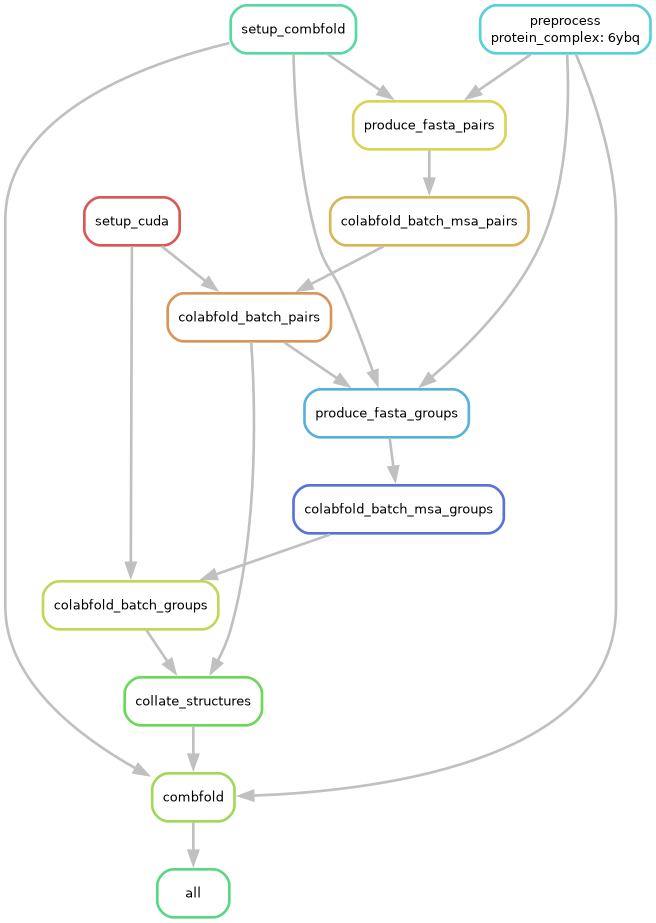

# Complex-prediction

This will be a snakemake pipeline to predict complexes with
[Combfold](https://www.nature.com/articles/s41592-024-02174-0).

## Usage

This snakemake 🐍 project is powered by [pixi 🚀](https://prefix.dev/), it
handles _all_ of the dependencies (@me if it don't!). Installing the pipeline
involves the following steps:

```bash
# Install pixi
curl -fsSL https://pixi.sh/install.sh | bash

# Print the help
pixi install

```

The hardware requirement is a CUDA 11.8 or higher enabled graphics driver. If
this is met, analysis can begin!

```
# Run the whole analysis pipeline from begining to end for all files in `data`
pixi run make
```

Usage in a HPC context is done with the

```
pixi run jobscript
```

command, this will launch a 24 hour long job with 18 cores with 12800 mb of GPU
memory. Then once the job is submitted and working, the `err` log will contain
logs from the snakemake output (such as startup messages etc), and the `out`
log will contain standard output, written by programmes such as `colabfold`.

On raven, the test dataset took 3 hours to complete.

## Steps in the pipeline

The input data in the form of combfold formatted JSON files from `data` are
copied over to the `results/data` directory. Then the MSA's are fetched from
the combfold MSA server. These MSA data are then used to predict the protein 3D
structure of each _pair_ in the input dataset. Then Combfold is ran on the
structures.


