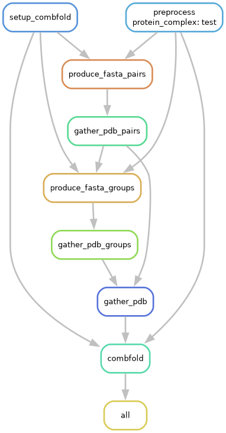

# Complex-prediction

This will be a snakemake pipeline to predict complexes with [Combfold](https://www.nature.com/articles/s41592-024-02174-0)

## Usage

This project is powered by [pixi 🚀](https://prefix.dev/), it handles _all_ of
the dependencies (@me if it don't!). Running the pipeline involves the following 
steps:

```bash
# Install pixi
curl -fsSL https://pixi.sh/install.sh | bash

# Print the help
pixi run help

# Later code

# Before running the pipeline, you must
# load the dependencies specified as git
# submodules
pixi run update_dependencies
```

## Steps


